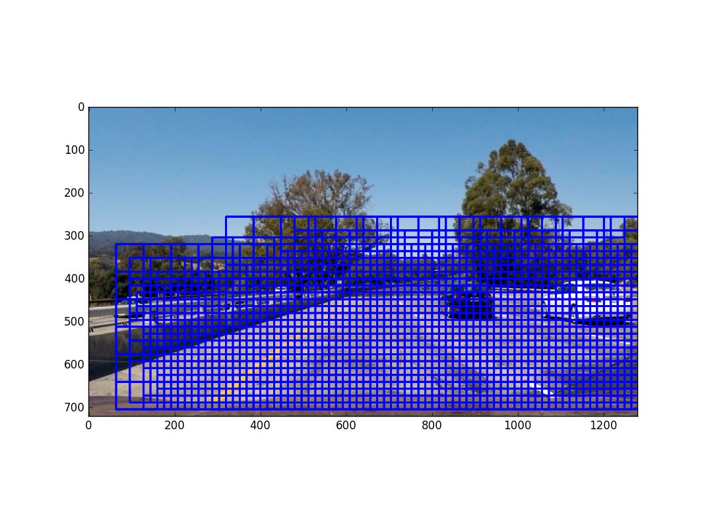
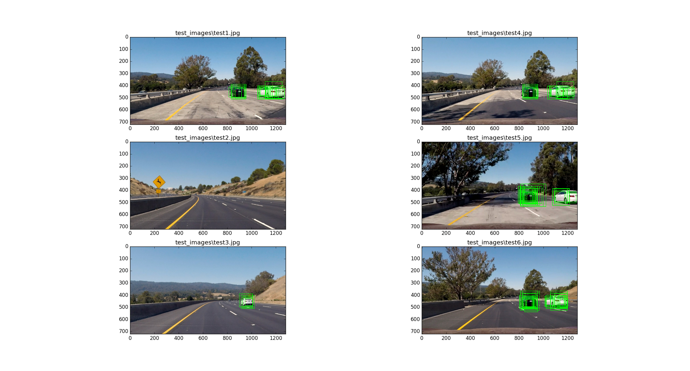
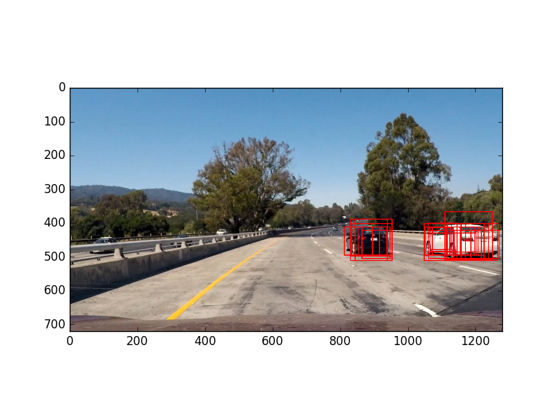
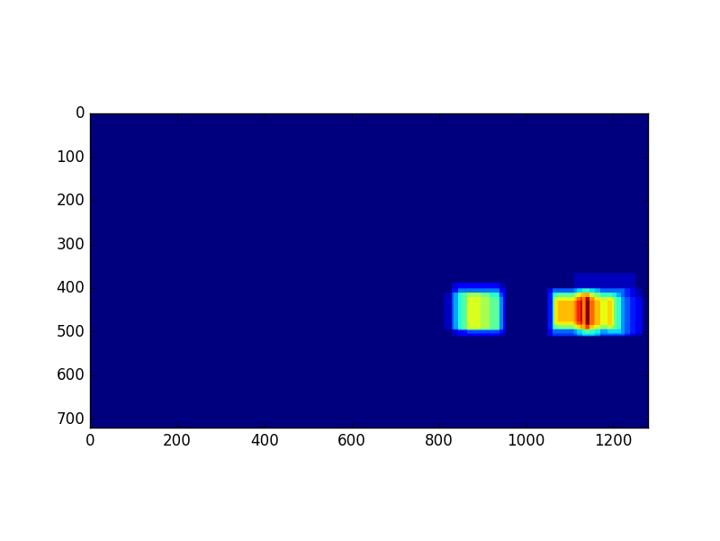
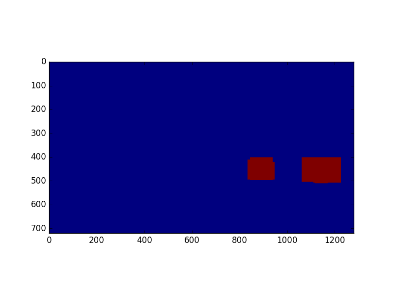
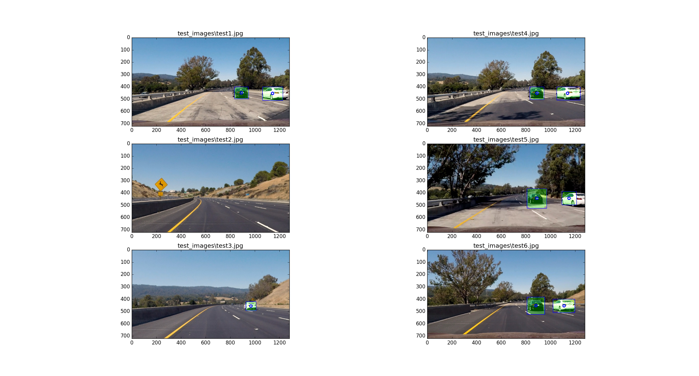
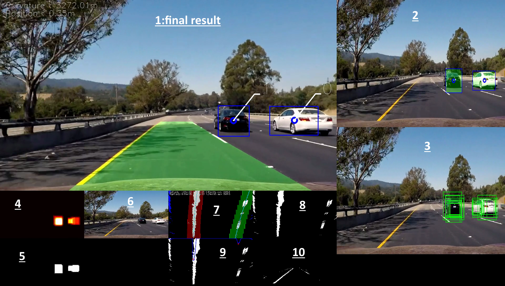

# Project sources files description

The project is composed of different python classes :

- **loadData.py** : 
Able to explore folder of the whole dataset, to set list of vehicles and no-vehicles samples.
There are few functions to explore the dataset as display images, statistics about classes...

- **features.py** :
From *loadData*, compute features for each sample, the whole feature is normalized. 
The dataset is randomized and splited in train and test set.
Dump the feature results in pickle file. 
Also dump the scaler (sklearn.preprocessing.StandardScaler) in a pickle file.

- **classif.py** :
From *features*, implement SVC to classify features. 
The SVC class is saved in a file with sklearn.externals.joblib
few functions, to compute the score on test and train set, display confusion matrix and plot SVC coefficients and feature index. (To determine each ones are significant).

- **slidingWindows.py** : 
Sliding windows implementation, with region of interest in the image. 
Pyramid windows, with size step and overlap tuning parameters. 
Extraction and resizing of all image windows for prediction in *classif* class. 
We will see later that because of compute effiency this implementation wasn't used in the video processing.

- **procesImage.py** :
All the processing steps for test images, and video conversion.

- **windowsReplay.py** :
To experiment the tracking algorithm, I have recorded all the sliding windows predicted car for each video frame in pickle file, and use it to tune tracking parameters.

- **object_tracker.py** :
Vehicles tracking implementation with a GNN algorithm (Global nearest neighbor  http://www.control.isy.liu.se/student/graduate/TargetTracking/Lecture5.pdf).

- **laneDetection.py** :
Few class to re-use project 4 lane detection.

# Information to run the project

If you want the run the project, run in this order :

1. features.py 
2. classif.py
3. procesImage.py

# Project conception and details

## features extraction	
I have tested different	kinds of features (color histogram, reduce size image, histogram of gradient), in few color spaces (RGB, HSV, LUV, HLS, YUV and LAB). 
I plot the *svc._coef* to see each feature apport. I sort them by importance. 
With this method, I have seen that color histogram is always the less efficient to discriminate our two classes (car and no-car). 
As well reduce size image is always lower importance than HOG. So I test HOG in different channels of different color spaces.
I have obtained my best result with LAB color space and a HOG on each channel. 
The feature size is 5292 for an image of 64x64 pixels. 

My parameters are : orient=9, pix_per_cell=8, cell_per_block=2

## Classification
I use linearSCV classifier. The feature are normalized with *sklearn.preprocessing.StandardScaler*. 
I have tried SCV(rbf), the score was better but the time to fit and predict was really huge. 
So the linearSCV seem to be a good compromise.

With C=1 the result is :
- accuracy on train 1.0
- accuracy on test 0.978

I test different values for C parameter to increase score on test set, and increase its generalization capacity.

My best result is with C=0.0001 :

- Training duration 2.66s
- accuracy on train 0.997
- accuracy on test 0.992
- confusion matrix train set: 

 [[8192   14]
 
 [  30 7455]]
- confusion matrix test set: 

 [[1450   13]
 
 [   9 1298]]

## Sliding windows
First, I generate sliding pyramid windows from size 32x32, 64x64, 96x96 and 128x128. 
The windows fully outside region of interest are not append to reduce their numbers.
The overlap is 0.5. I obtain 2214 windows to process.

Example of the 2214 sliding windows with ROI :

All the windows are resized to 64x64 pixels and Features extraction (LAB conversion and HOG) in the same matrix. 
Then I normalize it and predict with SVC. All these operations are really slow, around 10s per image. 
So I try a other idea.

# sliding windows optimized

The idea is to compute the HOG on the whole image and slide windows in feature directly (without ravel !).
For a 64x64 image, a single channel HOG feature shape is [7,7,2,2,9] x 3 channels.
So in the whole HOG image I select a [7,7,2,2,9] array features and reshape its to line (with *.ravel()* function). (see function : *fullFrameHogAnalyse* in *processImage.py*)
I slide this "windows" for each *pix_per_cell*, so the overlap is 7/8. I concatenate all in one matrix, to normalize and predict.
For multiscale search, I resize the whole image before HOG extraction. (See function : *FullFrameMultiScaleProcess* in *processImage.py*))
In my final solution, I do it for 5 different scale factors : [1.0,1.3,1.7,2.2,2.9] it match to 64x64, 83x83, 108x108, 140x140 and 185x185 window sizes.

Of course I kept the ROI to reduce the number of windows. And the image top before HOG operation is clippped (sky part).
With these parameters, the total number of windows is 10898 (A huge overlap !).
The cpu time to compute one image (1280x720) is around 2s, so really more efficient (around x25 faster) than my first sliding windows/features implementation.

To reduce the number of false positive, I compute and threshold on *decision_function*.

The result on test images is below:

The result is good not too much false negative, so I don't implement hard negative mining.

## Windows merging
All the windows for the same car have to be merged in only one bounding box.

For that I use a "*hot point*" image (*heat map* seems to be a better word, sorry for my english !). 
In a *float* image, I add the *decision_function* result on each windows. 
And I obtain this kind of result :

I threshold it, to segment:

I use the *cv2.findcontours* function to extract shape contours. *cv2.boundingRect* returns me the bounding box, 
and *cv2.moments* able me to compute the centroids.

The results on test images is below (green : sum of thresholded hot point (*heat map*)):

## video processing

I have processed the project video with this pipeline and the result is not so bad. The processed video is here: https://www.youtube.com/watch?v=PLFG7eKJ17o

There are  sometime a false positive, so I will implement a tracking solution to label the car and remove if their age are too young.

## tracking
I implement a GNN algorithm (Global nearest neighbor  http://www.control.isy.liu.se/student/graduate/TargetTracking/Lecture5.pdf).
For all targets predicted in hotpoint image (heat map), I test the shortest distance with actual cars tracked position. (test all the combinations : not very efficient if there are lots of cars in the image).
If this distance is below a threshold, I increase the age of the car, add update its position. 
If the car does not have a target its age is decreased.
If targets don't find associated car, I create a new car object to track this new target.

If the age is above a threshold, the car is displayed, to filter short time false positive detections. 
If the target isn't detected during few frames, its age decreases to 0, so the car isn't deleted immediatly. 
So the target will detect few frames after, the car will have the same tracking index.
Now we are able to have a "unique index number" for each vehicle tracked. 
So to smooth the result, I average the position and the bounding box of each car. 

To easily tune tracking parameters, I increase the computing speed by dumping all the sliding windows classification results to a file.
The file will be replayed with windowsReplay class.

## lane detection
I have just refactorized my project 4 code in *LaneDetection* class, and run it from input image.

# final video
The final result seems to be nice. 
The video file is pushed in Git : *videoOutputFinalProject.mp4*.
It could be also found here : https://www.youtube.com/watch?v=GRynrQc-2_M

Description of each "debug video" patchwork :

1. The final output with averaged tracking position/bounding box and car labeling
2. The output of *findcontour* function and centroid extraction (from hotPoint (heat map) segmentation)
3. The predicted sliding windows result
4. Hotpoint (heat map) image
5. Segmented hotpoint image
6. The original input image
7. Lines search (project 4)
8. Unwrapped perspective image (project 4)
9. Global histogram research (project 4)
10. Image line extraction (project 4)

# Improvements
A lot things I think !

Tracking could be improved with quite logic. For example, to don't merge two vehicles in one when they are superimposed. 

# Acknowledgements

All the slack community and particulary *Kyle Stewart-Frantz* !
